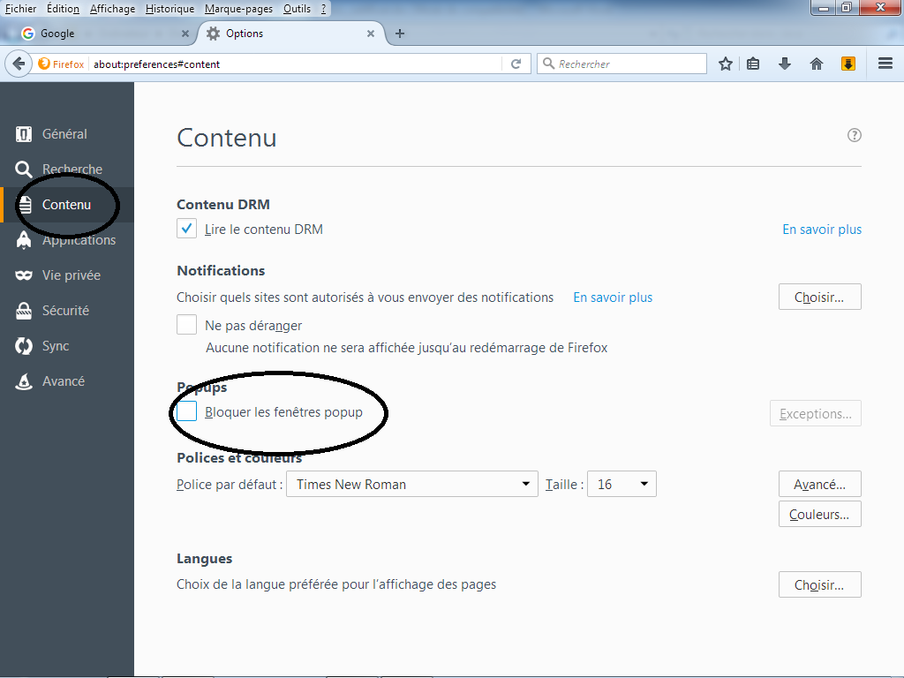

# Installation INDIM@J
## Activation des Popup et exceptions
---

### **Désactiver le bloqueur de fenêtres Popup**

{ width="600" }

>**Etapes à suivre**

1. Dans Firefox, allez dans **Outils › Options › Contenu**.
2. Décochez la case **« Bloquer les fenêtres popup »**.
3. Cliquez sur **OK**.

!!! warning "ATENTION"
    Sans cette option, les éditions INDIM@J ne pourront pas s'afficher.
