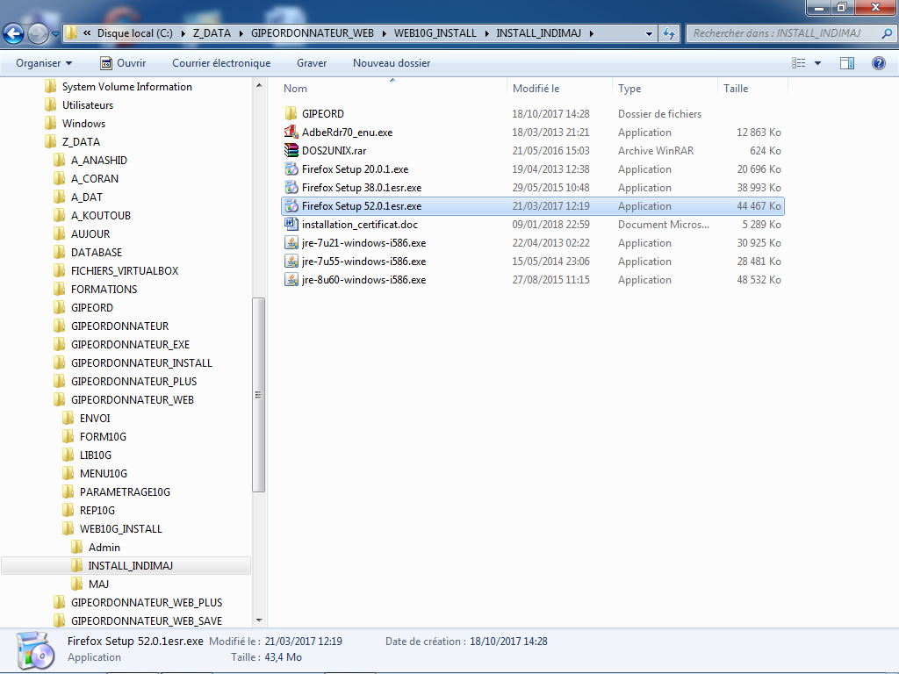
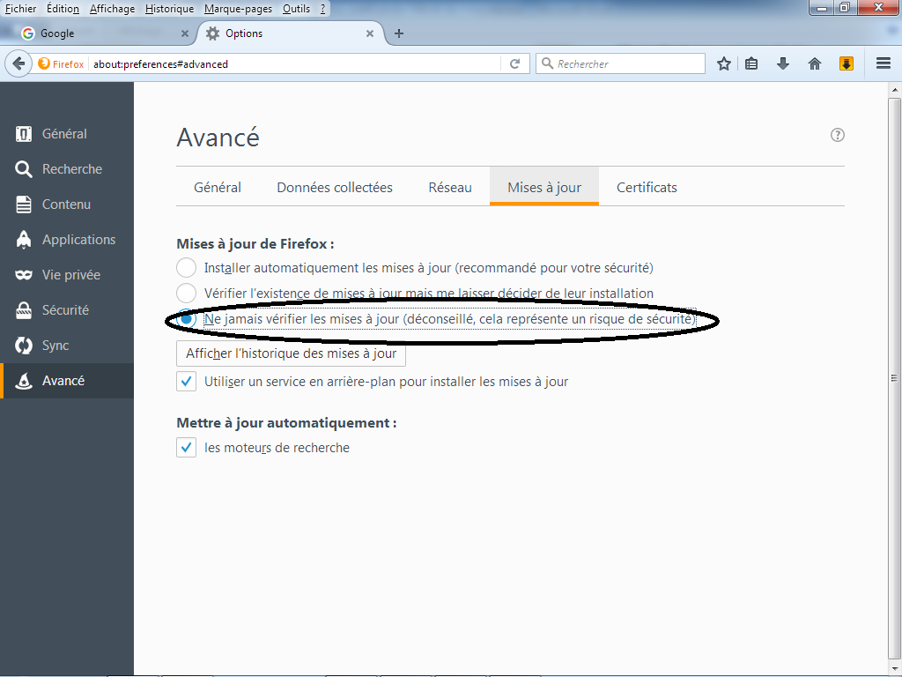

# Installation INDIM@J
## Installation de Firefox
---
### **Télécharger et installer Firefox 52 ESR**
{ width="600" }

>**Etapes à suivre**

1. Dans le dossier **INSTALL_INDIMAJ**, sélectionnez le fichier **Firefox Setup 52.0.1esr.exe**.
2. Double-cliquez pour lancer l'installation et suivez les instructions.

### **Désactiver la mise à jour automatique de Firefox** 

{ width="600" }

>**Etapes à suivre**

1. Ouvrez Firefox puis allez dans **Outils › Options**.
2. Cliquez sur **Avancé** puis l'onglet **Mises à jour**.
3. Sélectionnez **« Ne jamais vérifier les mises à jour »**.
4. Cliquez sur **OK**.

!!! warning "ATTENTION"
    Utilisez exclusivement la version Firefox 52 ESR pour garantir la compatibilité avec INDIM@J.