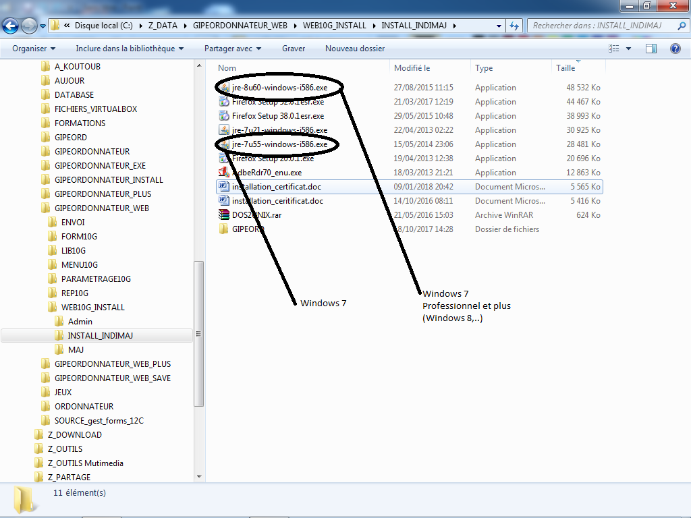
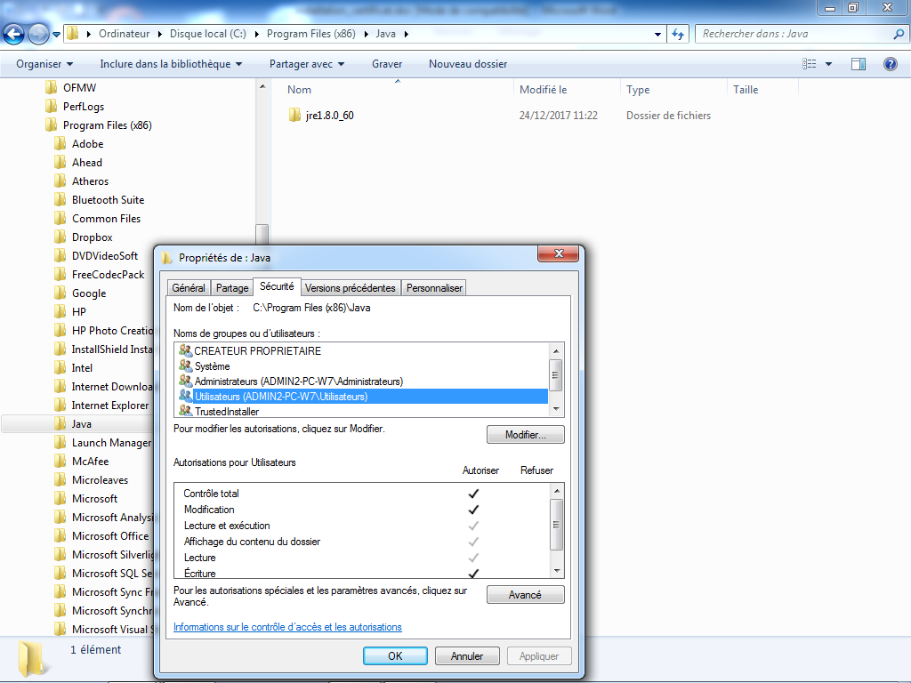

# Installation INDIM@J
## Installation de Java
---
### **Choisir la bonne version de Java selon Windows**

{ width="600" }

>**Etapes à suivre**

1. Dans le dossier **INSTALL_INDIMAJ**, identifiez votre version de Windows.
2. Pour **Windows 7** : sélectionnez jre-7u21-windows-i586.exe.
3. Pour **Windows 7 Professionnel et plus (Windows 8+)** : sélectionnez jre-8u60-windows-i586.exe.
4. Double-cliquez pour lancer l'installation.

### **Permettre le droit d'écriture sur le répertoire Java** 

{ width="600" }

>**Etapes à suivre**

1. Naviguez vers **C:\Program Files (x86)\Java**.
2. Clic droit sur le dossier **Java › Propriétés › Sécurité**.
3. Sélectionnez le groupe **Utilisateurs**.
4. Cliquez sur **Modifier** et cochez la case **Écriture**.
5. Cliquez sur **OK**.
